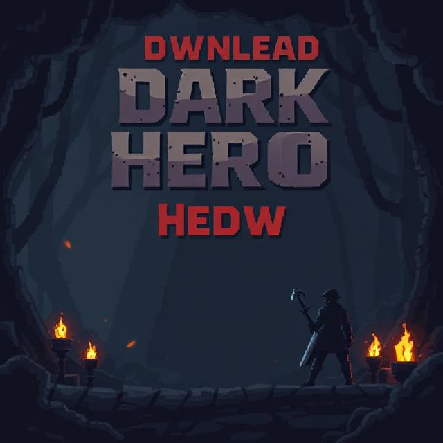
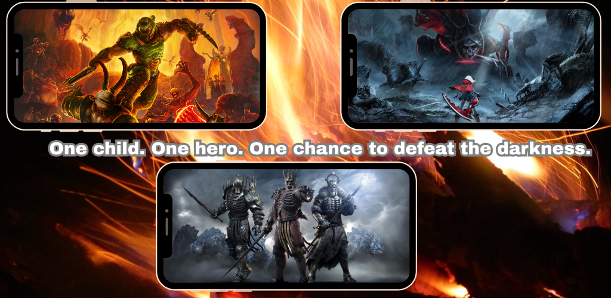
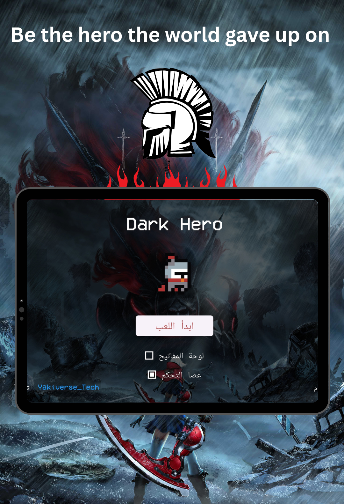
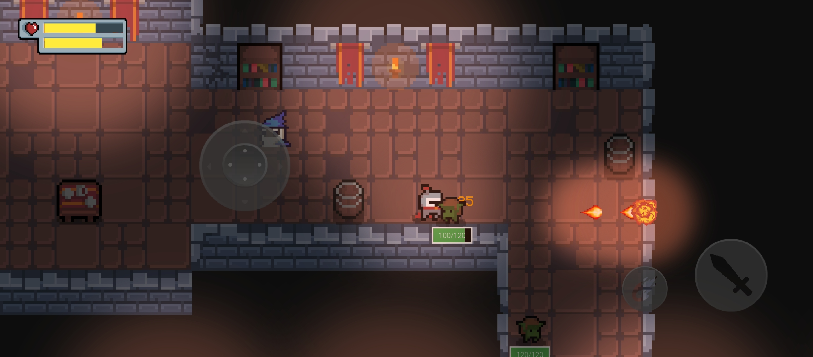

# 🕶️ Dark Hero

A **free, open-source Flutter RPG game** built from scratch using modern UI/UX, modular architecture, and offline-first gameplay.

**Dark Hero** is a futuristic 2D action RPG written in Dart/Flutter. It features real-time combat, a moral choice system, and full source code — ideal for developers looking for a template or inspiration for their own games.

> 🚀 Fully open source under the MIT License.  
> 🔧 Perfect base project for indie devs or student portfolios.
---

## 👤 About the Developer

I'm **Yahi Abdelhak (aka Klaro-0)** — a tech enthusiast, indie game developer, and creator of digital experiences. I’m passionate about building apps and games that are fast, offline-first, and user-driven.

💡 **Philosophy**: *"I don't wait for perfect conditions to build — I build to create them."*

### 🔗 Connect with Me

- 🧑‍💻 GitHub: [@Klaro-0](https://github.com/Klaro-0)
- 📷 Instagram: [@klyro_o](https://www.instagram.com/klyro_o/)
- 💼 LinkedIn: [Abdelhak Yahi](https://www.linkedin.com/in/abdelhak-yahi-258a23263/)
- 📫 Email: [yahiabdelhak7@gmail.com](mailto:yahiabdelhak7@gmail.com)

---

## 🧠 Introduction

Welcome to **Dark Hero**, a passion-driven indie game project born from the idea of exploring what it means to be a hero in a broken world. Developed as part of my journey in software development and game design, this project is an experiment, a showcase, and a story — all in one.

> 🎯 **Goal**: Create a high-performance, customizable game using Flutter that runs offline, supports modular gameplay, and reflects the player's moral path.

Whether you're here to play, fork, or collaborate — you're welcome to the dark side.

---

## 🎮 Game Concept

Set in a cyber-noir universe, you play as a lone vigilante navigating chaos, corruption, and supernatural forces. Your path diverges depending on the choices you make:

- **Light Path**: Focuses on healing, defense, and honor  
- **Shadow Path**: Emphasizes stealth, chaos, and brutal power  
- **Neutral Path**: Balanced abilities but unpredictable consequences  

---

## 🚀 Key Features

- ⚔️ Real-time tap + combo combat engine  
- 🌗 Light & Shadow moral alignment system  
- 🔓 Unlockable skills and upgrades  
- 🤖 Basic AI system for enemy movement and attacks  
- 📱 Offline-first game (no backend required)  
- 🧩 Modular game architecture for scaling  

---

## 🛠️ Tech Stack

| Tech        | Description                              |
|-------------|------------------------------------------|
| **Flutter** | Cross-platform UI/game framework         |
| **Dart**    | Primary programming language             |
| **JSON**    | Local game save system                   |
| **Rive/Spine** | (Planned) Animations & cutscene FX      |
| **MVC**     | Clean code structure                     |
| **Provider**| State management (may switch to Riverpod)|
| **VS Code** | Main development environment             |

---

## 📁 Folder Structure

dark_hero/
│
├── lib/
│ ├── models/ # Player, enemies, abilities
│ ├── views/ # Game screens, HUD
│ ├── controllers/ # Game logic and input
│ ├── utils/ # Helper functions, constants
│ └── main.dart # Entry point
│
├── assets/
│ ├── images/
│ ├── sounds/
│ └── animations/
│
├── pubspec.yaml # Flutter dependencies & assets
├── .gitignore
├── README.md
├── LICENSE

## 📸 Screenshots

### 🧭 Main Menu

### ⚔️ Combat Demo

### 💥 Fight Demo

### ☠️ Dead Screen

### 🧙 Mana Bar Active

### 🧪 Game Revisit

